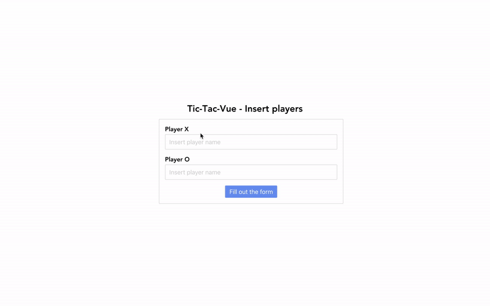

# Tic-Tac-Vue
**Tic-Tac-Vue** is a simple JavaScript Single Page Application (SPA) written with [Vue](https://vuejs.org/v2/guide/index.html), [Vuex](https://vuex.vuejs.org/) and [Vue Router](https://router.vuejs.org/). Its goal is to be a "case study" for beginners who want to learn Vue and its powerful ecosystem.

Click [here](https://testal.app/tic-tac-vue/) to try the online demo version.



## Table of content
* [Methodologies](#methodologies)
* [Technical skills](#technical-skills)
* [Install](#install)
* [Usage](#usage)

## Methodologies
In this project I adopted two methodologies I currently use in [MotorK](https://www.motork.io/) (the company I've been working with) to have a better factored code and organized source files: BEM and Atomic Design.
### BEM
**BEM** (which means Block Element Modifier) is a methodology that helps you to create reusable components in front-end development. It's all about splitting your CSS classes using **Blocks**, **Elements** and **Modifiers**. The final DOM could be verbose, but you will have a better factored source code and, because of you don't have to nest CSS classes, your CSS bundle will result less heavy.

To read more about BEM pattern, click [here](http://getbem.com/naming/).
### Atomic Design
**Atomic Design** is a methodology for creating design systems.
Similarly to chemistry, you can organize your components file (in this scenario Vue Single File Components) using **atoms**, **molecules** and **organisms**.
#### Atoms
Atoms are the basic building blocks of matter. Applied to web interfaces, atoms are our HTML tags, such as a form label, an input or a button.
#### Molecules
Molecules are groups of atoms bonded together and are the smallest fundamental units of a compound.
#### Organisms
Organisms are groups of molecules joined together to form a relatively complex, distinct section of an interface.

To read more about Atomic Design pattern, click [here](http://bradfrost.com/blog/post/atomic-web-design/).

(*This project doesn't have organisms: it only has atoms, molecules and pages.*)

## Technical skills
First of all, I strongly suggest you to have a look at Vue documentation, especially to:
* [Vue instance](https://vuejs.org/v2/guide/instance.html)
* [Vue lifecycle](https://vuejs.org/v2/guide/instance.html#Instance-Lifecycle-Hooks)
* [Vue data](https://vuejs.org/v2/guide/instance.html#Data-and-Methods)
* [Vue methods](https://vuejs.org/v2/guide/events.html#Method-Event-Handlers)
* [Vue props](https://vuejs.org/v2/guide/components-props.html)
* [Vue computed properties](https://vuejs.org/v2/guide/computed.html#Computed-Properties)
* [Vue Single File Components](https://vuejs.org/v2/guide/single-file-components.html)
* [Vuex state](https://vuex.vuejs.org/guide/state.html)
* [Vuex getters](https://vuex.vuejs.org/guide/getters.html)
* [Vuex mutations](https://vuex.vuejs.org/guide/mutations.html)
* [Vue Router](https://router.vuejs.org/)

These are the minimum requirements to have a better approach with Tic-Tac-Vue.

## Install
You can install **Tic-Tac-Vue** cloning the project:
```
git clone https://github.com/Sanfra1407/tic-tac-vue.git
```
then install npm dependencies:
```
npm install
```

## Usage
Since this project has been developed with the amazing [Vue-CLI](https://cli.vuejs.org/), you can use its own integrated CLI commands to serve or build the application.

#### Start dev server
```
npm run serve
```

#### Compiles and minifies for production
```
npm run build
```

#### Lints and fixes files
```
npm run lint
```